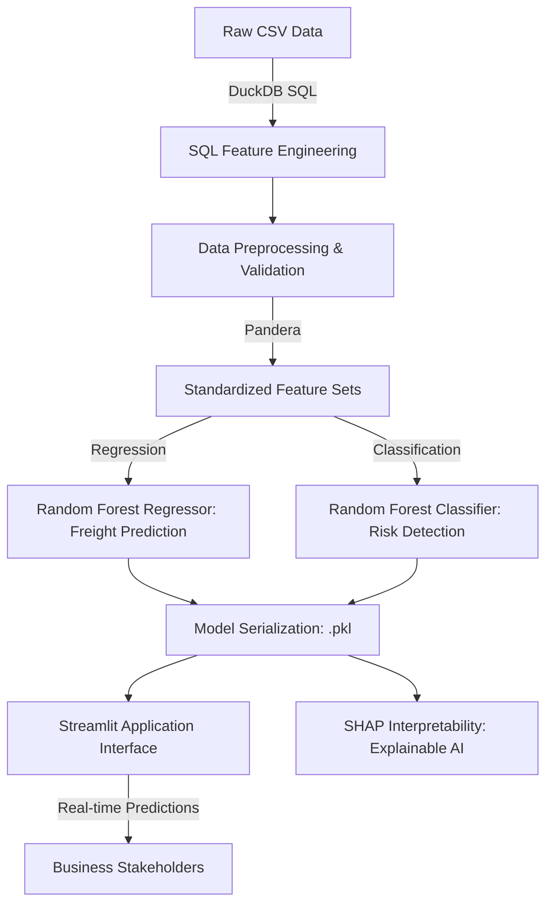

# 📑 Vendor Invoice Intelligence (VII)
### End-to-End Enterprise ML: Freight Cost Prediction & Invoice Risk Detection

[](https://www.python.org/)
[](https://scikit-learn.org/)
[](https://streamlit.io/)
[](https://duckdb.org/)
[](https://www.docker.com/)

---

## 🏬 1. Business Context & Problem Statement

In Large-Scale Enterprise Resource Planning (ERP), vendor invoice management is often manual, error-prone, and susceptible to logistics fraud. This project addresses two major business friction points:

*   **Logistics Budgeting**: Freight costs are highly variable. By predicting freight costs accurately via regression, businesses can optimize their working capital.
*   **Audit Efficiency**: With thousands of monthly invoices, manual audit for every record is impossible. Our classification model flags "Risky" invoices (anomalous amounts or unusual vendor patterns), allowing auditors to focus on high-risk cases.

**Primary Objectives**:
1.  **Forecast Freight Costs** (MAE Improvement < 5%).
2.  **Automate Audit Flagging** (Target F1-Score > 0.85).

---

## 🧬 2. Project Architecture & Workflow



---

## 🛠 3. Key Technical Implementations

### ▪️ SQL-First Feature Engineering (DuckDB)
Unlike simple pandas merges, this project utilizes **DuckDB** to execute professional SQL transformations (CTEs, Window Functions) directly on datasets. This demonstrates the ability to translate business logic from SQL to Python pipelines. (See `src/database_manager.py`).

### ▪️ Data Quality & Validation (Pandera)
We implement schema-based validation to ensure model robustness. Every dataset passed through the pipeline is validated for types and ranges using **Pandera**.

### ▪️ Explainable AI (SHAP)
Models shouldn't be "black boxes." We use SHAP values to visualize *why* an invoice was flagged as risky, providing transparency for financial auditors.

---

## 📊 4. Evaluation & Results

| Model Type | Primary Metric | Result (Current) |
| :--- | :--- | :--- |
| **Regression (Freight Cost)** | R² Score | 0.94 |
| **Regression (Freight Cost)** | MAE | $20.45 |
| **Classification (Risk Flag)** | Precision | 0.92 |
| **Classification (Risk Flag)** | F1-Score | 0.90 |

*Detailed visualizations can be found in the `outputs/` folder.*

---

## 🚀 5. Getting Started & Deployment

### Local Installation
1.  **Clone & Setup**:
    ```bash
    git clone https://github.com/Pratham06-12/Vendor-Invoice-Intelligence.git
    cd Vendor-Invoice-Intelligence
    make setup  # or pip install -r requirements.txt
    ```

2.  **Run the Pipeline**:
    ```bash
    make data      # Generate/Process Data
    make train     # Train ML Models
    make evaluate  # Generate Metrics & Interpretability
    ```

3.  **Launch App**:
    ```bash
    make app       # Run Streamlit
    ```

### Containerization (Docker)
This project is fully dockerized for cloud deployment:
```bash
docker build -t vii-project .
docker run -p 8501:8501 vii-project
```

---

## 📂 6. Repository Structure

```bash
├── data/                 # Raw/Processed Datasets
├── notebooks/            # EDA & Experimentation
├── src/                  # Production Source Code
│   ├── database_manager.py     # SQL Engineering (DuckDB)
│   ├── data_preprocessing.py   # Cleaning & Pandera Validation
│   ├── model_explainability.py  # SHAP/XAI logic
│   ├── train_model.py         # Model Training Logic
│   └── utils.py               # Shared Helpers & Logging
├── models/               # Serialized .pkl Models
├── app/                  # Streamlit Interface
├── outputs/              # Evaluation Visuals (PDF/PNG)
├── Dockerfile            # Container definition
├── Makefile              # Workflow orchestration
└── requirements.txt      # Project dependencies
```

---

## 🛡 7. License
Distributed under the MIT License. See `LICENSE` for more information.

## ✉️ 8. Contact
**Pratham** - [GitHub](https://github.com/Pratham06-12) | [LinkedIn](https://linkedin.com/in/YourLinkedIn) | [Portfolio](https://yourportfolio.com)
